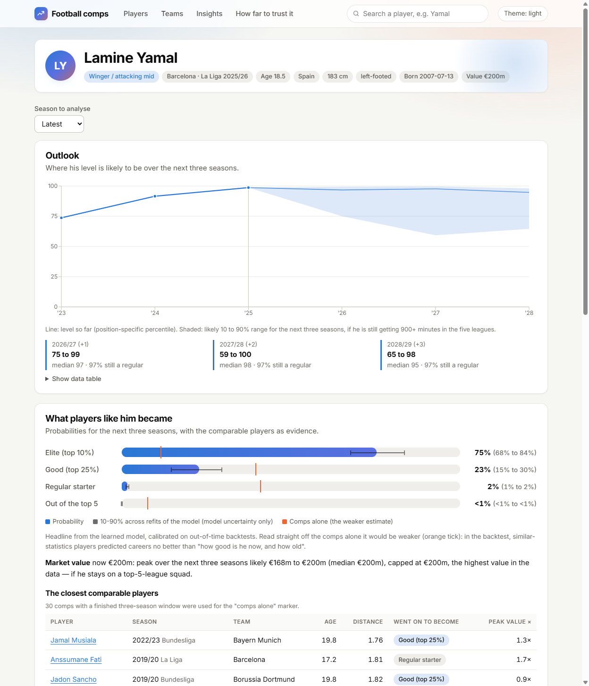
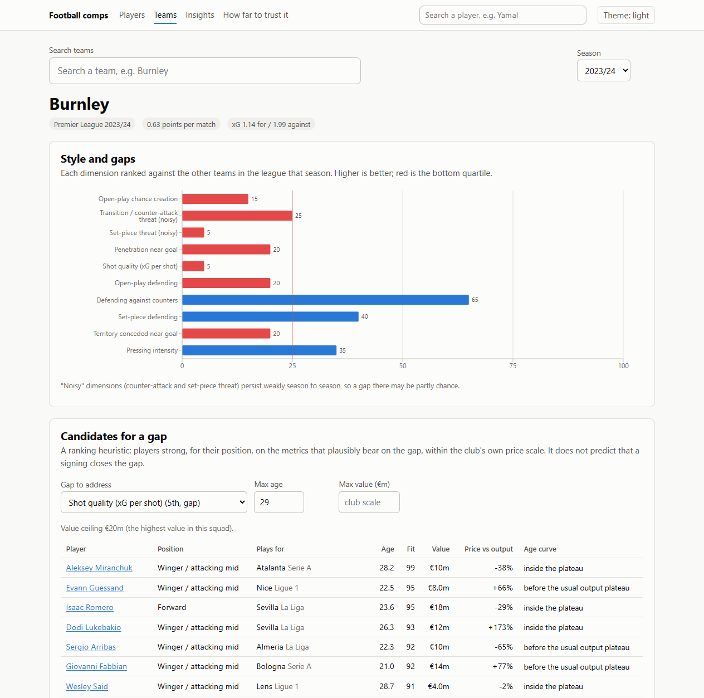
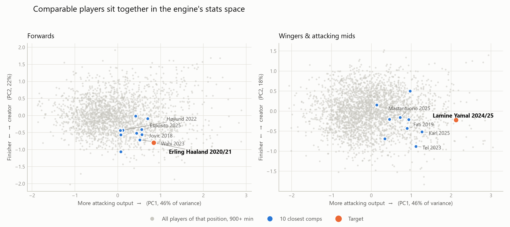
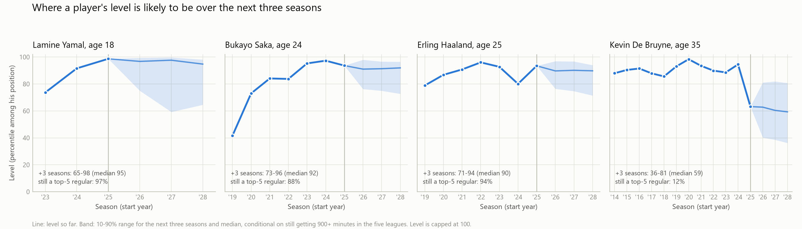
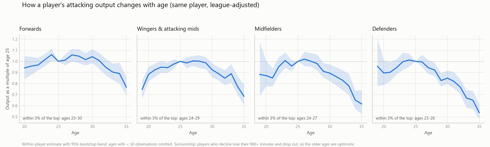

# Football player comps & trajectory projection

A scouting-analytics tool built on free data: it finds statistically similar football players (controlling for age, league quality and position), forecasts where a player's level is heading as a **fan chart with an uncertainty band**, flags players priced below what they produce, and profiles a team's style to show where it is weak.
> Status: pipeline, features, models, backtests, Django API and React app are built and tested (153 Python + 30 frontend tests, CI on both). It is designed as a **local tool**: the data is scraped into a 70 MB SQLite file on your machine, and `.\start.cmd` (Windows) starts the API and the web app with one command. Screenshots and example outputs are below.

## What this project is really about

Three problems that decide whether a tool like this can be trusted, and how each was handled:

1. **Linking players across sources with no shared id.** Understat, FBref and Transfermarkt spell names differently and only Transfermarkt has birth dates. A two-pass resolver (fuzzy name, then a club map *learned* from the first pass) links 97.6 to 100% of minutes in every league-season, one-to-one, and the two independent links agree on minutes for 99.95% of player-seasons. See *Entity resolution*.
2. **Comparing leagues without assuming a ranking.** The league-strength factor is estimated from 903 players who changed league, with bootstrap intervals, and the antisymmetry of the shifts is checked. See *League-strength adjustment*.
3. **Reporting what does not work.** The first design (statistical twins predict careers) **lost to a "same level, same age" baseline** in a leakage-controlled rolling-origin backtest. The headline model is now a regularised learned model that wins with intervals excluding zero, the comps are shown as evidence, and a leaky result (a +15.6 R-squared signal in signings) was caught and corrected to about +3. See *Trajectory forecast and backtest* and *Beyond the comps*.

| Result | Number |
|---|---|
| Entity resolution, share of minutes linked | 97.6 to 100% per league-season |
| Similarity engine vs chance (hit@10) | 0.39 vs 0.03 |
| Comps vs "same level" baseline (Brier, lower is better) | 0.598 vs 0.582 (comps lose) |
| Learned tier model vs baseline (holdout Brier) | 0.516 vs 0.589 |
| Fan chart vs shrinkage baseline (pinball, 1 to 3 seasons ahead) | 3.94 / 4.20 / 4.42 vs 4.16 / 4.49 / 4.57 |
| Most vs least underpriced decile, value change after correcting for leavers | +19% (1 season), +33% (2 seasons) |
| Do signings explain team style change? | about +3 R-squared points, not a recruitment guarantee |

## What you can do with it

Real outputs from the running app (data through the 2025/26 season in the five leagues).



**1. Where is a player heading?** Search "Lamine Yamal". His league-adjusted attacking level is the 98.7th percentile among wingers and attacking midfielders. The outlook for next season is a band, not a number: 10% / median / 90% of **75 / 97 / 99**, widening to **59 / 98 / 100** two seasons out, with a 97% chance he is still a 900+ minute regular in the five leagues. The three-season forecast from his 2024/25 season reads *elite 53% (model range 44 to 64%), good 42%, regular 5%, out 0.1%*, with the comparable players next to it: on their own they would have said 8% elite, which is why the backtest below demotes them to evidence.

**2. Who is he like, and where does he differ?** `python -m ml.comps "Lamine Yamal" --season 2024` lists his closest comps at the same age and position (Ansu Fati 2019, Mastantuono 2025, Mathys Tel 2023, Lennart Karl 2025, Musiala 2021, Wirtz 2021), what each became, and a strengths-and-gaps chart against them. For Erling Haaland at 20 the gaps read as a pure striker: +19 percentile points on non-penalty xG, -18 to -23 on tackles, interceptions and crosses.

**3. Is he priced fairly for what he produces?** The player page compares market value with what peers of the same position, age and output cost. For Yamal the page labels 2023 "overpriced" and 2024 and 2025 "fairly priced". Across all players, the most underpriced decile later gained 19% more value in a year than the most overpriced (see *Value versus performance* for the survivorship check behind that number).

**4. What does a team lack?** Open **Teams**, choose Burnley and 2023/24: 0.63 points per match against 0.89 expected, and a style profile ranked against the league. The weak spots are shot quality (5th percentile), open-play chance creation (15th), penetration near goal (20th) and open-play defending (20th); transition and set-piece threat are also low but flagged as noisy dimensions. The shortlist then ranks affordable players for a chosen gap (it surfaces Aleksey Miranchuk, Angel Correa and Jacob Murphy for attack and Mallorca's Copete at EUR 2.8m for the back line), labelled as a heuristic because the signings test found only a weak link between signings and style change.



**5. How do players age?** **Insights** shows aging curves by position: forwards hold within 3% of their peak output from 23 to 30, midfielders only from 24 to 27, and by 33 forwards produce about 90% of their age-25 output, midfielders 78%.

**6. Why should I trust any of it?** **Method** lists every claim that was tested and whether it held up. The comps, for instance, did not.

The same results are available without the UI: every page is an API endpoint (`http://127.0.0.1:8000/api/docs/`) and the main analyses are command-line tools (`python -m ml.project`, `ml.team_report`, `ml.comps`, see the Quick start).

## Layout

| Path | Purpose |
|---|---|
| `data_pipeline/` | cached, rate-limited ingestion (Understat, Transfermarkt, FBref, StatsBomb) and entity resolution; framework-agnostic |
| `features/` | age, per-90 rates, league-strength adjustment, percentiles, team-style profiles; framework-agnostic |
| `ml/` | similarity engine, gap analysis, outcome definitions, learned forecasts, backtests, aging curves, value lens, outlook fan chart, recruitment shortlist; framework-agnostic |
| `backend/` | Django 5 + DRF read-only API, admin over the pipeline DB, management-command wrappers, API tests |
| `frontend/` | React 19 + TypeScript single-page app (Vite, TanStack Query, Recharts) |
| `tests/` | 94 tests for the pipeline, features and models |
| `docs/` | backtest outputs, figures, screenshots, the OpenAPI schema |
| `start.cmd`, `start.ps1` | one-command local launcher (Windows) |

## Quick start

To just see the app (Windows, after the data and caches exist): `.\start.cmd`. It opens http://127.0.0.1:5173. See *Frontend* for the options.

To build everything from scratch:

```bash
pip install -e ".[dev]"
python -m data_pipeline.ingest_statsbomb --list
python -m data_pipeline.ingest_statsbomb --competition 9 --season 281   # Bundesliga 2023/24
python -m data_pipeline.ingest_understat --seasons 2014 2025            # all five leagues
python -m data_pipeline.ingest_transfermarkt --seasons 2014 2025        # squads: birth date, nationality, value (~1h, 3s/request)
python -m data_pipeline.ingest_transfermarkt --history --history-limit 500   # per-player value + transfer history, resumable
python -m data_pipeline.link_understat_tm                               # Understat id -> Transfermarkt id
python -m data_pipeline.ingest_fbref --seasons 2014 2025                # FBref via soccerdata (~1 h, opens Chrome)
python -m data_pipeline.link_fbref_tm                                   # FBref -> Transfermarkt
python -m features.build                                                # age, per-90, league adjustment, percentiles
python -m ml.comps "Lamine Yamal" --season 2024                         # closest comparable players + gap analysis
python -m ml.evaluate_similarity                                        # label-free metric check
python -m ml.visualize                                                  # PCA sanity figure -> docs/comps_pca.png
python -m ml.project "Lamine Yamal" --season 2024                       # forecast: probabilities + value range + comps as evidence
python -m ml.backtest --out docs/backtest_h3.txt --calibration-out docs/elite_calibration.json   # rolling-origin backtest (~6 min)
python -m data_pipeline.ingest_understat_teams                          # team style data (~20 min, cached)
python -m ml.plot_aging                                                 # aging curves figure
python -m ml.evaluate_outlook --out docs/outlook_backtest.txt           # fan-chart backtest (~5 min)
python -m ml.plot_outlook                                               # fan-chart figure
python -m ml.evaluate_value_lens --horizon 1                            # value-vs-performance backtest
python -m ml.team_report "Burnley" --season 2023                       # team style, gaps, candidate shortlists
pytest
```

Downloads are cached under `data/cache/` (never re-fetched) and requests are rate-limited. Output lands in `data/db/football.sqlite`.

## Data caveats

StatsBomb open data covers only selected competitions/seasons (e.g. only Bayer Leverkusen for Bundesliga 2023/24), so it is the event-level source, not the backbone for career histories. Understat (xG/xA, 2014–2025, top-5 leagues) is the breadth source. It is fetched with plain `requests` through the shared cache rather than `soccerdata`, whose TLS client ignores HTTP proxies.

Transfermarkt provides what the stat sources lack: birth date, nationality(ies), position, height, season-end market value (squad pages) and, per player, market-value history and full transfer history including youth/reserve moves (the pathway signal for the similarity engine). Squad pages are HTML; history comes from the site's own JSON endpoints. Requests go through the shared cache at 3 s intervals with an honest User-Agent.

FBref works through `soccerdata` on a normal machine: it drives its own automated Chrome via seleniumbase (a window will appear and navigate; your normal browser is unaffected, but leave that window alone while it runs). `soccerdata` keeps its own cache in `~/soccerdata/`, outside `data/cache/`. FBref has withdrawn its Opta-based advanced tables, so only `standard`, `misc` and `keeper` are available: minutes, goals/assists, cards, tackles won, interceptions, crosses, fouls, nationality, birth year, and goalkeeper saves/shots-on-target-against/clean sheets. No xG, passing or pressure data comes from FBref. Tackle and interception definitions appear to change between 2017 and 2023 (the tackle/interception ratio flips), so they are ranked within season and never compared raw across seasons. Ingested integrity check: FBref's total minutes per league-season are within 0.4% of Understat's for all 60 league-seasons, so no page was truncated.

## Entity resolution

Understat has no birth dates or nationalities, so linking it to Transfermarkt rests on names plus club context, in two passes (`data_pipeline/entity_resolution.py`, `link_understat_tm.py`):

1. **Name pass** — accent/order-insensitive fuzzy match over one record per Transfermarkt player (a mid-season mover appears in two squads; without deduplication identical names tie and are rejected as ambiguous). Accept only above a threshold *and* clearly ahead of the runner-up.
2. **Club pass** — the Understat-club to Transfermarkt-club mapping is *learned* from the name-pass matches (no hand-written alias table), then leftovers are matched inside their club with a relaxed threshold, requiring a shared name token and a clear winner. This resolves nicknames (`Alex Grimaldo` / `Alejandro Grimaldo`, `Danny` / `Daniel Drinkwater`).

FBref is linked to Transfermarkt the same way (`link_fbref_tm.py`) but has no player id and only a birth *year*, which acts as a hard veto (`PlayerRecord.birth_year`). Coverage is reported weighted by minutes played, since missing a bench player matters far less than missing a starter. Understat results over all 60 league-seasons (2014–2025, top-5 leagues), share of Understat minutes linked to a Transfermarkt player:

| League | Name pass (min–max of seasons) | After club pass (min–max) | Players linked via club pass |
|---|---|---|---|
| Bundesliga | 97.8–99.9% | 98.7–100.0% | 32 of 5813 |
| EPL | 97.6–99.1% | 99.4–100.0% | 112 of 6424 |
| La_liga | 92.3–95.4% | 97.6–99.3% | 338 of 6792 |
| Ligue_1 | 96.7–99.4% | 97.9–100.0% | 101 of 6658 |
| Serie_A | 96.8–99.0% | 98.9–99.7% | 76 of 6887 |

The club pass matters most in La Liga (~93% -> ~98%), where compound and accented names defeat the name pass. Precision is checked by consistency: an Understat id must map to the same Transfermarkt id in every season. Only 17 of 9,434 players (0.18%) violated that, all mononyms (Juanfran, Mariano, Emerson, Toño) that a name cannot separate; those links are dropped rather than guessed (`drop_conflicts`). Final table: 9,410 players, 32,206 player-seasons, strictly one-to-one. A manual read of the first 24 club-pass matches found no errors.

FBref coverage is 98.2–100% of minutes in every league (club pass: 269 of ~32,500 players). Because Understat and FBref are linked to Transfermarkt independently, with different evidence, they give a label-free precision check: for the 32,020 player-seasons linked by both, 32,004 (99.95%) agree on minutes played to within 10% / 90 minutes, whereas a wrong link in either source would produce a large gap. These are consistency checks, not a labelled-ground-truth precision number.

## Feature engineering & league adjustment

`python -m features.build` writes `player_season_features` (one row per Understat player-season) and `league_strength` to the database.

- **Age** is decimal years on 1 January of the season's end year (mid-season), from Transfermarkt birth dates (known for 98.8% of rows).
- **Position group** (GK / DEF / MID / WING_AM / FWD) comes from Transfermarkt, with Understat's coarse label as fallback (99.8% known). Wingers and attacking mids are split from centre-forwards because their shot and chance profiles differ.
- **Per-90 rates** for goals, assists, xG, npxG, xA, shots, key passes, xG chain, xG build-up.
- **Percentiles** rank only players with 450+ minutes: `*_pct_league` within (league, season, position group), and `*_pct_global` within (season, position group) across all leagues on league-adjusted rates.

### League-strength adjustment

A fixed league ranking would be an assumption; instead the factor is estimated from players who actually changed league. A player's ability changes little over a season or two, so how their output (npxG + xA per 90) shifts after a move measures the difficulty gap. The model is a within-player regression with league effects and age/age² terms, estimated on 903 movers observed in different leagues within one season of each other, with 95% intervals from a cluster bootstrap over players:

| League | Factor | 95% interval |
|---|---|---|
| Ligue 1 | 1.095 | 1.04–1.14 |
| Bundesliga | 1.088 | 1.03–1.15 |
| Serie A | 1.045 | 1.00–1.10 |
| La Liga | 0.940 | 0.90–0.99 |
| EPL | 0.854 | 0.82–0.89 |

A factor of 0.85 means the same player typically produces ~15% less attacking output per 90 in the EPL than the average of the five leagues. Per-90 volume stats are divided by it to get comparable rates.

How far to trust it:
- **Supported:** the raw pairwise shifts are antisymmetric (every route *into* the EPL lowers output by 0.17–0.28 in log terms, every route *out* raises it by 0.12–0.17; Ligue 1 ↔ La Liga mirror each other too), which regression to the mean alone would not produce. A same-season-movers-only check (93 players) gives the same picture for the EPL (0.81) and Bundesliga (1.09).
- **Uncertain:** the order of the three middle leagues. Their intervals overlap and the same-season check reorders them.
- **Caveats:** movers are a selected group (regression to the mean after standout seasons can exaggerate gaps); the factor mixes difficulty with league style (the Bundesliga is goal-heavy); it is estimated on npxG + xA and applied to all volume-type attacking rates; only these five leagues are covered, so lower leagues need another source before the Hamza Abdelkarim case study can use it.
- **Defenders and goalkeepers (FBref):** tackles won, interceptions, crosses, fouls and fouls drawn per 90, with percentiles within (league, season, position group). These are *not* league-adjusted: the strength factor was fitted on attacking output and has not been validated for defensive actions. Goalkeepers get save percentage and shots on target faced per 90. Without post-shot xG, save% is a noisy quality proxy (percentile 71 for Alisson 2022 on 3,330 minutes), and percentiles rank raw values, so a higher percentile means a higher value, not necessarily better. Defenders' profiles are still thin compared with attackers' (no pressures, progressive passes or duels).
- **Data limit:** raw per-90 values for players with tiny minutes are meaningless (e.g. 2 minutes at 19 npxG/90); use the percentile columns or filter on minutes.

## Similarity engine

`python -m ml.comps "Erling Haaland" --season 2020` returns the closest comparable player-seasons and a gap analysis against them (`ml/similarity.py`, `ml/gap_analysis.py`).

What "comparable" controls for:
- **Position:** hard filter on position group.
- **Age:** hard window of +-1.5 years plus a soft penalty, because "what did players with this profile at 19 become" is the question the trajectory model asks.
- **League quality:** stats are the league-adjusted rates above; the league's strength and the size of the league jump from the previous season are separate context features.
- **Missing data:** a query uses only the features its target has. FBref's defensive stats do not exist before 2016, so a 2014 season is compared on attacking stats, against candidates that have them. The result reports which features were used.

Distance is a weighted sum of block distances (attack stats, defence stats, context, age) over z-scored square-root rates. The block weights are design judgements, **not tuned**: tuning them against the test below would only reward context features that persist across seasons.

**Choosing the metric without labels.** A player is the same person across seasons, so within the same position group and age window a player-season's *other* seasons should rank near the top of its neighbours. Over 13,300 targets (stats only, context off):

| Metric | hit@10 | MRR | by chance |
|---|---|---|---|
| Euclidean | **0.393** | **0.212** | 0.031 |
| Mahalanobis (shrunk covariance) | 0.383 | 0.206 | 0.031 |
| Cosine | 0.357 | 0.187 | 0.031 |

All three beat chance by roughly 12x, so the stats capture player style. The simplest metric wins (Mahalanobis's decorrelation does not help, cosine loses because it ignores magnitude), so Euclidean is the default. By position (Euclidean): midfielders 0.49 (chance 0.03), wingers/attacking mids 0.45 (0.04), forwards 0.40 (0.05), defenders 0.36 (0.02), **goalkeepers 0.15 (0.08)** since they have only two features. This measures whether the representation captures style, not whether comps predict careers; that is the backtest's job.

Example output (comps shown are distinct players, closest season each):

| Target | Closest comps |
|---|---|
| Lamine Yamal 2024/25 (age 17.5) | Ansu Fati 2019, Mastantuono 2025, Mathys Tel 2023, Lennart Karl 2025, Musiala 2021, Wirtz 2021 |
| Jamal Musiala 2021/22 (18.8) | Ibrahim Maza 2025, Ben Seghir 2024, Karl 2025, Bellingham 2022, Pulisic 2016, Vinicius Jr 2019 |
| Erling Haaland 2020/21 (20.4) | Sepe Wahi 2023, Luka Jovic 2018, Hojlund 2022, Esposito 2025, Sesko 2023, Isak 2020 |

The gap analysis then reads, for Haaland against those comps: strong on non-penalty xG (+19 percentile points) and build-up involvement; weak on tackles won, interceptions, crosses and fouls drawn (-18 to -23), which is what a pure striker should look like.



PCA of the engine's own stats space: PC1 is overall attacking output (all attacking features load the same way), PC2 separates finishers from chance-creators. Comps sit in a tight neighbourhood around the target (median distance to the target is about half that of a typical same-age, same-position player: 0.76 vs 1.46 for Haaland, 1.37 vs 2.43 for Yamal). Extreme profiles sit at the edge of the cloud, so their comps lie between them and the pack. PCA is a 2-D shadow of an ~11-dimensional space.

Limits to keep in mind:
- Comps are by statistical profile. The backtest below shows they do not predict careers better than simple baselines, so they serve as evidence, not as the headline probability.
- Without pressures, progressive passing or duels, the engine cannot separate a deep-lying holder from a box-to-box midfielder (Rodri's gap analysis shows him "weak" on tackles and interceptions mainly because his comps are not pure defensive midfielders).
- Pathway features are partial: league strength and league jump are in; transfer-history features (origin club tier, reserve vs first-team football) and non-top-5 origins are not, so the Hamza Abdelkarim case needs lower-league data first.

## Trajectory forecast and backtest

`python -m ml.project "Lamine Yamal" --season 2024` answers "what do players like this become?" with outcome probabilities and a range, a market-value range, and the comps as visible evidence (each with what it became). The honest story is in how it got built: the first design lost to simple baselines, and the headline model is now a different one.

**What "become" means** (`ml/outcomes.py`, horizon = next 3 seasons), defined two independent ways:
- **Performance tier:** peak of a position-specific composite percentile (league-adjusted attacking output) over the next three seasons, as *elite* (top decile), *good* (top quartile) or *regular*, or *out* when the player has no 900+ minute top-5 season in the window (left the five leagues, lost his place, retired, injured). Defenders and goalkeepers only get retained / out, because Understat says little about their quality.
- **Market value:** peak Transfermarkt squad-page value in the next three seasons divided by the value now, conditional on staying on a top-5 squad.

Windows that are not yet complete are never scored.

**The backtest** (`ml/backtest.py`) is rolling-origin: for each season 2018 to 2022 it rebuilds the features from data up to that season only (league-strength factors included), predicts the next three seasons for every player aged 23 or under with 900+ minutes (1,378 targets, 852 players), and scores against what happened. Leakage rule, asserted in code: every comp or training row used must have a *finished* outcome window by the origin date. Models are compared on Brier score, log loss and pinball loss, with 95% intervals bootstrapped over players, against:
- **B0** base rate for the same position and age (no model),
- **B1** "same level": the k players of that position and age closest on the one current number (composite percentile, or current market value), with the same shrinkage and k as the comps model; this tests whether multi-dimensional similarity earns its complexity,
- **comps**: outcomes of the 30 most similar players (the similarity engine above), shrunk toward the base rate,
- **learned**: regularised logistic regression (tiers) and gradient-boosted quantiles (value) on a few summary features (current level, age, minutes, last season's change, league strength and jump, market value).

Protocol: the comps configuration was fixed before any result was seen. The learned models were then developed on origins 2018 to 2020 only; 2021 to 2022 are reported separately as a holdout. (A first version of the learned model, with different regularisation, was seen on the holdout; no setting was chosen using it.)

| Lower is better | B0 base rate | B1 same level | comps | **learned** |
|---|---|---|---|---|
| Performance tier, Brier (n=824) | 0.617 | 0.582 | 0.598 | **0.512** |
| Performance tier, log loss | 1.176 | 1.078 | 1.134 | **0.897** |
| Same, holdout 2021 to 2022 (n=326), Brier | 0.641 | 0.589 | 0.607 | **0.516** |
| Retention, Brier (n=1,378) | 0.113 | 0.111 | 0.112 | **0.100** |
| Market value, pinball (n=1,313) | 0.181 | 0.177 | 0.186 | **0.166** |
| Market value, 80% interval coverage | 0.81 | 0.75 | 0.76 | 0.79 |

What the intervals say (model minus baseline, 95% interval; negative means the model is better):
- **Comps lose to "same level".** Performance Brier +0.017 [+0.007, +0.027]; market value pinball +0.009 [+0.005, +0.013]. They beat the base rate on tiers (-0.019 [-0.027, -0.010]) but add nothing for retention. Similar stats do not predict a career better than "how good is he now, and how old".
- **The learned model wins everywhere.** Versus same-level: performance Brier -0.069 [-0.095, -0.044] (holdout alone: -0.073 [-0.105, -0.042]), retention -0.010 [-0.013, -0.007], value pinball -0.011 [-0.014, -0.007].
- **Where the gain comes from.** Dropping market value barely matters (Brier 0.519 vs 0.512), so it is not just the market's opinion. A level-and-age-only version scores 0.539, still better than same-level matching (-0.043 [-0.062, -0.025]): a smooth fit over thousands of rows beats averaging 30 neighbours. Minutes, last season's trend and league add the rest.
- **Ranking:** AUC for "becomes elite" is 0.890 (current composite alone: 0.869). The top 10% by P(elite) were 41.5% elite against a 7.4% base rate.

So the comps are the *evidence* and the learned model is the *headline*. The forecast shows both: the comps' own outcome mix appears next to the model's probabilities.

Failure cases, not hidden:
- **Calibration:** the raw model overstates P(elite) between 20% and 70% (holdout: predicted 0.34, observed 0.16 for the 20 to 50% bucket). A Platt map fitted on out-of-time predictions fixes the buckets and improves holdout Brier from 0.516 to 0.510, but the log-loss gain has an interval spanning zero (-0.012 [-0.031, +0.012]), so it is a correction for a bias seen in both blocks, not a proven improvement. P(out) is well calibrated.
- **Confident misses of the learned model:** Fabian Ruiz and Jadon Sancho (P(elite) 0.84, both ended "good"), Alex Iwobi, Mason Mount, Gabriel Martinelli. **Breakouts it still undersold:** Vinicius Jr, Saka and Rodrygo got 0.17 to 0.36 (the comps said 0.01).
- **Thin early pool:** at the 2018 origin only 2014 and 2015 outcomes are known, so the comps model had about 11 usable comps per target; the other origins about 30.
- **Definitions matter:** "elite" is a stats composite at a fixed cut (top decile); "out" mixes injury, retirement and moving to a league outside the data; market value is only observed while on a top-5 squad; forecasts are capped at the highest value in the data (EUR 200m) because too few players sit near the top for the model to learn a ceiling. The 80% value interval covers 79% overall.
- **Scope:** top-5 leagues only, a 3-season horizon, attacking composites for outfield players. Lower-league and non-European origins (the Hamza Abdelkarim case) need other data.

## Beyond the comps: outlook, aging, value and team needs

The backtest above showed that "find the statistical twins" adds little for predicting a career. These four pieces are what the data supports instead. Each was tested out of sample or against a baseline, and the negative results are kept.

### Player outlook: a fan chart (`ml/outlook.py`, `ml/evaluate_outlook.py`)

Where will a player's level be in one, two and three seasons? Level is the position-specific composite percentile (0 to 100, forwards, wingers and midfielders), and the answer is a 10/50/90% band, not a line:



The band is **conditional on the player still getting 900+ minutes in the five leagues** (otherwise there is no level to measure), so a second model gives the probability that he does; the charts print it (Yamal 97% three seasons out, De Bruyne at 35 only 12%). Three forecasters were compared in a rolling-origin backtest (origins 2018 to 2022, features rebuilt as of each origin, 7,250 forecasts for 1,273 players, scored against what happened):
- **persistence**: the player stays where he is, with the empirical spread of what actually happened,
- **shrinkage**: regression toward the position mean, fitted per position and horizon (the winner of the aging test),
- **quantile GB**: gradient-boosted 10/50/90% regressors on current level, last season's change, age, minutes, league strength and jump, market value, position.

| Mean pinball loss (lower is better), all ages | h=1 | h=2 | h=3 |
|---|---|---|---|
| persistence | 4.39 | 4.82 | 4.95 |
| shrinkage | 4.16 | 4.49 | 4.57 |
| **quantile GB** | **3.94** | **4.20** | **4.42** |
| GB minus shrinkage (95% interval) | -0.22 [-0.28, -0.15] | -0.28 [-0.37, -0.21] | -0.15 [-0.27, -0.05] |
| 10-90% band coverage (target 80%), GB | 0.78 | 0.78 | 0.78 |

The learned quantile model beats both baselines at every horizon with intervals that exclude zero, but the gain over plain shrinkage is modest (about 3 to 6% of the loss). Median error is 12.8, 13.6 and 14.3 percentile points at one, two and three seasons, against 14.0, 15.4 and 15.8 for persistence. It helps most for young players (24-and-under: -0.27, -0.42, -0.27 against shrinkage, and its band is better calibrated, 0.77 to 0.80 versus 0.74 to 0.76 for shrinkage) and for players of 30 and over at one and two seasons; for ages 24 to 29 at three seasons it is not distinguishable from shrinkage (-0.08 [-0.19, +0.04]).

Where it falls short, kept in:
- **Bands are slightly too narrow**: 78% coverage for a nominal 80%, and 76 to 78% for players of 30 and over.
- **Survival is a little optimistic**: the predicted chance of still being a top-5 regular was 69%, 59% and 51% at one, two and three seasons against 66%, 55% and 46% realised (still clearly better than the base rate: Brier 0.183, 0.204 and 0.199 against 0.224, 0.248 and 0.249).
- **The level is a stats composite at the top end of a bounded scale**, so elite players' bands are clipped at 100 and say little beyond "stays elite".
- **Defenders and goalkeepers are not covered** (no composite), and a player whose latest season had under 900 minutes (injury) gets an outlook from his last qualifying season, with a note saying so.

### Aging curves (`ml/aging.py`)

How a player's attacking output changes with age, estimated **within player** (the same people as they get older, so cohorts do not mix), league-adjusted, normalised to the same-season position mean, with a 95% bootstrap band:



Output stays within 3% of its maximum for ages 23 to 30 (forwards), 24 to 29 (wingers and attacking mids), 24 to 27 (midfielders) and 23 to 26 (defenders, for attacking involvement). By 33, forwards produce about 90% of their age-25 output, midfielders 78% and defenders 67%. A single "peak age" is not well determined (the curves are flat and noisy near the top), so the plateau is reported instead. Survivorship flatters the older ages: players who decline stop getting 900 minutes and leave the sample.

**Does the curve help forecast?** Rolling-origin test, 1 to 3 seasons ahead, by age band. Regression to the mean does nearly all the work: shrinking a player's last output toward the position mean cuts next-season error by about 9% versus assuming persistence (it wins in 19 of 20 position-origin cells; about 70% of a player's relative output carries over from one season to the next, 54% for defenders). Adding the aging curve on top changes error by under 3% almost everywhere: slightly better for players 22 and under three seasons out (-2.4%), worse for players 30 and over three seasons out (+6.0%). The curve describes aging well and forecasts it poorly, because a year of aging moves output by 5 to 10% while season-to-season noise is far larger.

### Value versus performance (`ml/value_lens.py`, `ml/evaluate_value_lens.py`)

A pricing model predicts a player's market value from current output (the attacking composite and last season's), age, minutes, league and position; the gap between actual and predicted value is how far he is priced below ("underpriced") or above ("overpriced") peers who produce the same. Covers forwards, wingers and midfielders. The question is whether the gap predicts what happens to the value next. Protocol: at each origin from 2016 to 2023 the model is refit on data up to that season and **cross-fitted by player** (a residual never comes from a model that saw that player), then the value change is compared across residual groups within each position and season.

**First result: +24% over one season, and the check that cut it down.** Players in the most underpriced decile gained about 12.7% in value over the next season, the most overpriced lost 9.2%, a gap of 24% (95% interval +0.147 to +0.278 log points). But the change is only visible for players who stay on a top-5 squad, and only 64% of the most underpriced were still there a year later against 95% of the most overpriced: cheap players churn out of the leagues far more. If leavers had been losing half their value, the whole effect would vanish. So the leavers were measured instead of guessed: Transfermarkt's value history follows a player after he leaves (the 15 June value reproduces the season-end squad value for 93% of players exactly), and it was fetched for every leaver in the extreme deciles.

**Corrected result** (everyone in the deciles, leavers included, value change net of the same position-season average):

| Horizon | Most underpriced minus most overpriced | 95% interval | Was (stayers only) |
|---|---|---|---|
| 1 season | **+19%** | +0.115 to +0.240 log points | +24% |
| 2 seasons | **+33%** | +0.191 to +0.403 | +51% |
| 3 seasons | +42% | +0.183 to +0.525 | +78% |

Underpriced players who left the five leagues lost about 22% of their value on average (-0.25 log points) over a season, versus a 4% gain for those who stayed, so survivorship was real but moderate. The effect is positive for forwards, wingers and midfielders alike at one and two seasons, and in both halves of the sample, but weaker in 2020 to 2023 (+0.128 at one season) than in 2016 to 2019 (+0.219); at three seasons midfielders are borderline (+0.259, interval +0.003 to +0.507) and the recent origins include zero (+0.203, -0.032 to +0.427). The residual stays strongly predictive (t of about -11 at one season, -8 at three) after controlling for starting value and age.

What it does and does not say. This is about **Transfermarkt's value estimate** catching up with production, not about transfer fees or a club's profit; value is revised a few times a year so part of any gap is lag; and cheap players have a floor to fall to while expensive ones do not, which the starting-value control only partly addresses. Defenders and goalkeepers are not covered. Treat it as "who is priced low for what he does", a screen to look at, not a buy signal.

### Team style and needs (`features/team_style.py`, `ml/signings.py`, `ml/recruit.py`)

**Data.** Understat's team endpoint, which the free pipeline had not used, gives every team-season (1,170 across the five leagues) what a team creates and concedes split by situation, attack speed (fast / normal / slow) and shot zone, plus PPDA and deep completions per match. That is broader than StatsBomb's open event data, which covers a single Bundesliga season for one club. No new scraping beyond about 1,200 requests, cached.

**Profile and gaps.** Ten dimensions (open-play chance creation, transition threat, set-piece threat, penetration near goal, shot quality; open-play, counter and set-piece defending, territory conceded; pressing), each ranked against the league that season, oriented so higher is better. A gap is a dimension in the bottom quartile. Face validity: Leicester 2015 is at the 100th percentile for transition threat, Burnley 2017 near the bottom for transition and penetration, Manchester City 2018 tops pressing and penetration, Atletico Madrid 2018 has strong set pieces (95th) with low pressing (25th). Style persists season to season for pressing (r = 0.72), penetration (0.85), shot quality (0.61) and open-play defending (0.64), but much less for transition (0.40) and set pieces (0.33), so gaps on those two are flagged as noisy.

**Do signings fix gaps? (`ml/signings.py`)** The recruitment idea needs the players a team brings in to move the dimension they are bought for. An observational test on 922 team transitions: do arrivals and departures (what they were good at, as percentiles within position) explain the change in each dimension beyond regression to the mean, scored out of sample grouped by team? **A first version said yes, strongly (+15.6 points of R-squared), and that was wrong.** It scored arrivals on the season in which they play for the new club, but a team's xG is literally the sum of its players' xG, so that is an accounting identity, not a signal. Redone with what a recruiter could have known (arrivals judged on their previous season, weighted by previous minutes; arrivals with no prior top-5 season as a separate "unknown" feature), the gain falls to **+3.0 points on average (+1.7 to +4.5, positive in all 10 dimensions)**. The one clearly supported association is intuitive: creative and progressive arrivals (xA, xG build-up) raise open-play chance creation. The rest of the player-metric to team-dimension map is mostly noise, and arrivals with no prior top-5 history are associated with *worse* team percentiles.

**Recruitment shortlist (`python -m ml.team_report "Burnley" --season 2023`).** Given that evidence, the shortlist is deliberately a labelled heuristic: for each gap it ranks candidates (suitable positions, age at most 29) by their percentile on the metrics that plausibly drive the gap, capped at the market value of the club's most valuable player so that it recommends players the club could plausibly buy, and shows price versus output and where the age sits on the position's plateau. It does **not** claim a signing closes the gap, and set-piece defending is reported as unmappable (the free data has no aerial duels or marking). For Burnley 2023/24 (gaps in chance creation, penetration, shot quality and defending) it surfaces players such as Aleksey Miranchuk, Angel Correa, Jacob Murphy and, for the back line, Mallorca's Copete at EUR 2.8m.

## Backend API (Django REST Framework)

`backend/` is a Django project that serves everything above over a read-only JSON API. The modelling code stays framework-agnostic (`data_pipeline/`, `features/`, `ml/` import nothing from Django); the backend imports it and holds the fitted models.

```bash
pip install -e ".[dev]"                          # includes Django, DRF, drf-spectacular, pytest-django
cd backend
export DJANGO_DEBUG=1                            # or set DJANGO_SECRET_KEY (required when DEBUG is off)
python manage.py migrate                         # Django's own tables (admin login) only; the pipeline DB is never migrated
python manage.py build_forecast_cache            # fit once (~95 s), pickle to data/cache/forecaster.pkl (55 MB)
python manage.py runserver                       # http://127.0.0.1:8000/api/docs/  (Swagger UI),  /admin/
```

| Endpoint | What it returns |
|---|---|
| `GET /api/v1/players/search/?q=` | accent-insensitive autocomplete, ranked by match then career minutes |
| `GET /api/v1/players/{id}/` | bio (Transfermarkt), every season with per-90 rates and percentiles |
| `GET /api/v1/players/{id}/comps/?season=&k=` | comparable players with what each became, plus gap analysis |
| `GET /api/v1/players/{id}/forecast/` | outcome probabilities with a range, value range, comps as evidence, caveats |
| `GET /api/v1/players/{id}/outlook/` | fan chart: 10/50/90% level for the next 3 seasons and P(still a regular) |
| `GET /api/v1/players/{id}/value/` | price versus output by season (forwards, wingers, midfielders) |
| `GET /api/v1/aging/` | aging curves and plateaus by position |
| `GET /api/v1/teams/search/?q=`, `/teams/profile/?team=&season=` | team style profile with gap flags |
| `GET /api/v1/teams/shortlist/?team=&season=&gap=&max_value_m=` | candidate players for a gap (labelled heuristic) |
| `GET /api/v1/leagues/`, `/meta/`, `/health/` | league-strength factors, coverage and model info, liveness |

The OpenAPI schema (`/api/schema/`, committed as `docs/openapi.yaml`) is generated by drf-spectacular and validated in CI.

Design points worth knowing:
- **Two databases.** `default` holds Django's tables; `pipeline` is the pipeline's SQLite file, read through *unmanaged* models (SQLite `rowid` as primary key, a database router that forbids migrations there). Django's admin therefore browses pipeline output (players, entity-resolution links by stage, league factors, squads, transfers) read-only, with no add/change/delete.
- **Models are fitted once and shared.** The forecaster, value table, aging curves and team profiles are built by `build_forecast_cache` and pickled. The server loads the pickle in about 2.5 s (versus 95 s to refit) and falls back to building on first use if it is missing. With `PRELOAD_MODELS=1` it loads at start-up in a background thread, so `/health/` answers meanwhile. A request takes 0 to 70 ms once loaded.
- **The cache is keyed on the data it is built from, not the database file.** A fingerprint of the four tables the service reads (row counts and column sums) decides validity. The first version compared the file's modification time and was invalidated constantly by a Transfermarkt scrape appending value history to the same file; `test_cache_survives_writes_to_tables_the_service_does_not_read` pins that down.
- **Pipeline commands are `manage.py` commands too.** `ingest_understat`, `ingest_understat_teams`, `ingest_transfermarkt`, `ingest_fbref`, `ingest_statsbomb`, `link_understat_tm`, `link_fbref_tm`, `build_features`, `run_backtest` and `evaluate_value_lens` hand their raw command line to the framework-agnostic CLI (`python manage.py ingest_understat --leagues EPL --seasons 2020 2025`), so there is one implementation, not two.
- **Configuration is environment variables:** `DJANGO_SECRET_KEY`, `DJANGO_DEBUG`, `DJANGO_ALLOWED_HOSTS`, `CORS_ALLOWED_ORIGINS` (the React app's origin; the default is the Vite dev server), `FOOTBALL_DB`, `FORECAST_CACHE`, `FORECAST_BOOTSTRAPS`, `PRELOAD_MODELS`, `API_THROTTLE_ANON` (default 120/min). The API is GET-only, JSON-only and rate limited; the secret key is mandatory outside debug mode.
- **Tests (59 in `backend/tests`)** run the real `ml/` and `features/` code on a small synthetic football world, not mocks: endpoint shapes and error paths, outcomes withheld until a comp's window has finished, budget and age filters on shortlists, OpenAPI coverage, CORS, read-only methods, cache building and invalidation, and every command wrapper.

## Frontend (React + TypeScript)

`frontend/` is a Vite single-page app (React 19, React Router, TanStack Query, Recharts) that talks to the API above. It is a separate deployable: in development Vite proxies `/api` to Django; in production it calls `VITE_API_URL`, and that origin must be listed in the backend's `CORS_ALLOWED_ORIGINS`.


**Fastest way to try it (Windows):** `.\start.cmd` in the project folder checks the prerequisites, starts the API and the web app in two windows, waits until both answer, and opens http://127.0.0.1:5173. `.\start.cmd -Stop` stops them; `-BuildCache` rebuilds the model cache after you rebuild the data; `-NoBrowser` skips the browser. Or by hand:

```bash
cd frontend                    # needs Node 20.19 or newer
npm ci
npm run dev                    # http://localhost:5173 (start the Django API on :8000 first)
npm test                       # 30 Vitest tests
npm run build                  # type-check, then production build to dist/
npm run gen:api                # regenerate src/api/schema.d.ts from docs/openapi.yaml
```

| Page | What it shows |
|---|---|
| `/` | search with autocomplete, what the app does, a link to what failed |
| `/players/:id` | profile, **outlook fan chart**, outcome probabilities with ranges, the comparable players and what they became, strengths and gaps against them, price versus output, season table; season picker |
| `/teams?team=&season=` | the ten tactical dimensions against the league, gaps in red, and a filterable shortlist (gap, max age, budget) |
| `/insights` | aging curves by position, league-strength table |
| `/method` | every claim that was tested, with the verdict ("held up" or "did not hold") |


Design decisions worth knowing:
- **Types come from the API contract.** `src/api/schema.d.ts` is generated from the committed OpenAPI file, so a backend change that breaks the UI fails the type-check instead of failing in a browser. TypeScript is pinned to 5.9 because `openapi-typescript` needs the JavaScript compiler API that TypeScript 7 no longer ships.
- **The UI repeats the backtest's honesty.** The headline probability is the learned model; the comps are shown as evidence with an orange tick marking what they alone would say; noisy team dimensions are labelled noisy and the shortlist defaults to the weakest *reliable* gap; capped values say they are capped; "no outlook" explains why (defender, or too few minutes) instead of showing an empty chart.
- **Every chart has a text equivalent** (an `aria-label` summary and a data table), diverging charts carry a legend so colour is never the only cue, and the search box is a keyboard-operable ARIA combobox.
- **Theme tokens match the Python figures** (the same validated palette), with light, dark and follow-the-OS modes.
- **Errors carry the server's own message** ("No player with id 99.") and network failures say the backend is not reachable. Client errors are not retried; server errors are, twice.
- **Route-level code splitting.** The landing page is 86 KB gzipped; the 100 KB of chart code loads only when a chart page opens.
- **Tests (30)** cover the formatters, URL building and error parsing, the fan-chart data shaping, the autocomplete's debounce and keyboard behaviour, and whole pages rendered against a mocked API: profile, forecast evidence, a defender with no outlook, a 404, a malformed id, the season parameter, and the team shortlist defaults. One of them caught a real bug (the page requested `/players/NaN/` for a malformed id).

## Known gaps

- StatsBomb is not yet linked to Transfermarkt (it has no club-season squad table to block on).
- **Local by design, not hosted.** The app runs on your machine because the data is scraped and cached locally (a 70 MB database plus a 55 MB model cache). The two halves are still independently deployable (the API reads `PRELOAD_MODELS`, `CORS_ALLOWED_ORIGINS` and friends from the environment; the frontend reads `VITE_API_URL`), but no hosted demo exists.
- Per-player value and transfer history covers the 5,980 players with 900+ career minutes (170k value points, 69k transfers); the other ~3,400 linked players have only squad-page values. The value-lens results above were re-run on this full history: the one- and two-season results are unchanged, and the three-season result moved from +45% to +42%.
- The Egyptian-league case study and the Hamza Abdelkarim test (an 18-year-old Egyptian striker who came through Al Ahly's academy and now plays for Barcelona's reserve side) are not done: they need lower-league and non-European data that the free sources here do not provide.
- Pathway features from transfer history (origin club tier, reserve versus first-team football) are not in the similarity engine yet.
- A few players are missing from Transfermarkt squad pages (e.g. short loans); they stay unlinked rather than guessed.
